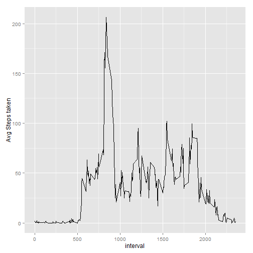
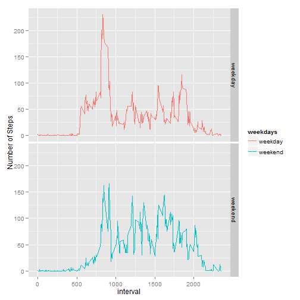

# Reproducible Research: Peer Assessment 1


##Loading and preprocessing the data
Here is the code for loading data.

```r
data <- read.csv("./activity.csv",header = TRUE)
```

##What is mean total number of steps taken per day?
Here is a histogram of the total number of steps taken each day

```r
d <- aggregate(steps ~ date, data, sum)
library(ggplot2)
ggplot(d, aes(x=steps)) + geom_histogram()
```

 

Here is the code for the mean and median total number of steps taken per day

```r
d <- aggregate(steps ~ date, data, sum)
mean1 <- mean(d$steps)
median1 <- median(d$steps)
```

```r
mean1
```

```
## [1] 10766
```

```r
median1
```

```
## [1] 10765
```

##What is the average daily activity pattern?
Time series plot of the 5-minute interval and the average number of steps taken, averaged across all days


```r
d2 <- aggregate(steps ~ interval, data, mean)
ggplot(d2, aes(interval, steps)) + geom_line()+ xlab("interval") + ylab("Avg Steps taken")
```

 

Which 5-minute interval, on average across all the days in the dataset, contains the maximum number of steps?

```r
d2[which.max(d2[,2]),]
```

```
##     interval steps
## 104      835 206.2
```

##Imputing missing values
Examine missing values 

```r
head(which(is.na(data$steps)))
```

```
## [1] 1 2 3 4 5 6
```

```r
which(is.na(data$date))
```

```
## integer(0)
```

```r
which(is.na(data$interval))
```

```
## integer(0)
```

Report total missing values

```r
length(which(is.na(data$steps)))
```

```
## [1] 2304
```

**Strategy for filling in all of the missing values**

Filling in missing values with mean for that **5-minute interval**

New data with the missing data filled in

```r
ndata <- data
ndata$steps<- replace(data$steps,which(is.na(data$steps)),d2$steps)
```

Histogram of the total number of steps taken each **after** missing values were imputed

```r
nd <- aggregate(steps ~ date, ndata, sum)
ggplot(nd, aes(x=steps)) + geom_histogram()
```

 

Calculate mean and median total number of steps taken per day

```r
mean2 <- mean(nd$steps)
median2 <- median(nd$steps)
```

Report and compare mean and median total number of steps taken per day

```r
mean2
```

```
## [1] 10766
```

```r
mean1
```

```
## [1] 10766
```

```r
median2
```

```
## [1] 10766
```

```r
median1
```

```
## [1] 10765
```

The outcomes are almost same from two parts, since imputing missing data with mean for that **5-minute interval**

##Are there differences in activity patterns between weekdays and weekends?
Create a new factor variable in the dataset with two levels

```r
Sys.setlocale("LC_TIME","C")
ndata$date <- as.Date(ndata$date)
ndata$weekdays <- weekdays(ndata$date)
ndata$weekdays <- as.factor(ndata$weekdays)
```

Check out levels of weekdays

```r
levels(ndata$weekdays)
```

```
## [1] "Friday"    "Monday"    "Saturday"  "Sunday"    "Thursday"  "Tuesday"  
## [7] "Wednesday"
```

Change levels of weekdays

```r
levels(ndata$weekdays)[c(1,2,5,6,7)] <- "weekday"
levels(ndata$weekdays)[c(2,3)] <- "weekend"
levels(ndata$weekdays)
```

```
## [1] "weekday" "weekend"
```

A panel plot containing a time series plot of the 5-minute interval and the average number of steps taken, averaged across all weekday days or weekend days

```r
d3 <- aggregate(steps~ interval+weekdays, ndata, mean) 
qplot(interval,steps,data=d3,geom = "line",facets = weekdays~.,col=weekdays,
      xlab="interval", ylab="Number of Steps")
```

 

**Thank you for your review!**
**Any feedback will be appreciated!**


